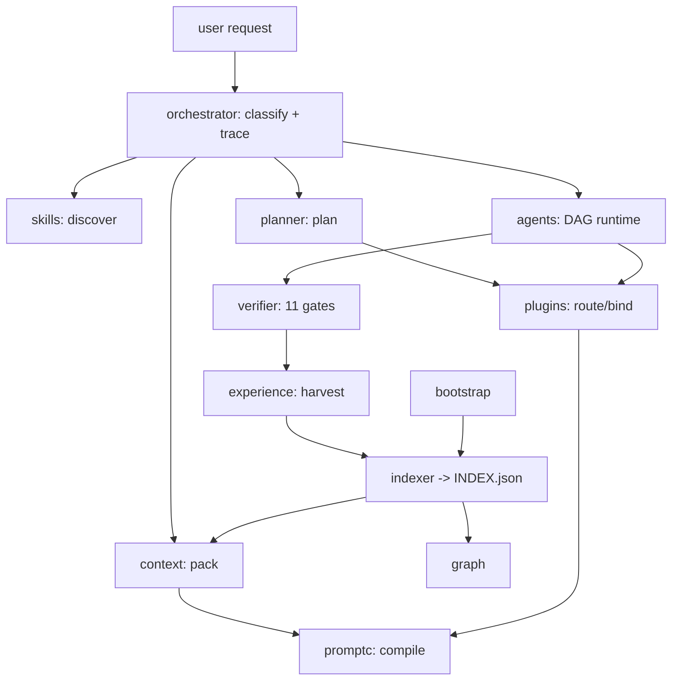

# ABSOLUTE ZERO — Principal Systems Audit

Full-architecture audit of the ABSOLUTE ZERO agentic OS (14 stdlib Python engines +
markdown vault). Goal assumed: outperform state-of-the-art coding agents through superior
orchestration rather than a proprietary model. Audited 2026-07-12 at commit `58414c8`.

---

# Executive Summary

ABSOLUTE ZERO is a deterministic orchestration layer for an LLM "CPU": every request is
classified, planned, context-packed, routed to tools, executed, verified, and harvested
for lessons — all by dependency-free Python scripts that a model of any vendor can drive
through plain CLIs. The architecture is genuinely unusual and genuinely good: behavior
lives in data tables, every engine carries a runnable selftest, artifacts are committed
but never indexed, and failures are designed to be loud.

The audit found **no data-corruption or security-compromise defects in committed code**,
but it found one systemic weakness (lexical-only intelligence duplicated across six
engines), one enforcement gap (the LLM can still skip the verifier — and once did, fault
#6), and a set of reliability holes (uncaught subprocess timeouts, no file locking under
the threaded agent runtime, zombie traces) that will surface exactly when the OS is under
real load.

```
Overall Health:     ★★★★★★★☆☆☆ (7/10)
Production Ready:   For single-user, single-session use — yes. Multi-session/agentic — not yet.
Major Risks:        4
Critical Bugs:      0
Security Issues:    2 (1 operational, 1 privacy)
Performance Risks:  3 (all scale-dependent, none active today)
```

---

# Repository Overview

| Aspect | Value |
|---|---|
| Language | Python 3.11+ (stdlib only, by law), Markdown |
| Build/deps | None — zero dependencies is an architectural invariant |
| Runtime | CLI scripts, run from vault root; cross-platform via `pathlib` |
| Entry points | 14 scripts in `scripts/`, 8 slash-commands in `.claude/commands/` |
| Persistence | Markdown notes + JSON artifacts in `90_META/`, git as sync/rollback |
| Specs | One root `*.md` contract per engine (ORCHESTRATOR.md, CONTEXT.md, …) |
| Tests | Every script has `--selftest`; verifier executes them on change |

Engines: indexer, query, review, orchestrator (state machine), context (budget manager),
planner, verifier (11-check gate), plugins (tool router), promptc (prompt compiler),
skills (skill discovery), experience (lesson harvester), agents (multi-agent DAG
runtime), graph (knowledge graph), bootstrap (repo onboarding).

# Architecture Assessment



**Strengths (Observed):**
- Layering is real: `orchestrator` is the shared kernel; higher engines import
  `classify`/`words_of`/`STOP` instead of duplicating them. The dependency graph is
  acyclic and the verifier enforces that.
- Data-table configuration (INTENT_KEYWORDS, STEPS, WORKFLOWS, MOTIFS) keeps behavior
  inspectable and cheap to extend.
- Model-agnostic by construction: every engine is a CLI with JSON output; any LLM or
  agent framework can drive it.
- The artifact discipline (`90_META/{traces,plans,runs,...}` committed, never indexed)
  is a clean solution to "memory of work" vs "memory of knowledge".

**Weaknesses:** single lexical classifier as semantic keystone (H1), similarity logic
re-implemented six ways (H2), configuration duplicated across engines (M4), honor-system
enforcement of the pipeline (H3). Detailed below.

Ratings: layer separation 9, coupling 7 (kernel-by-`sys.path`-hack), cohesion 8,
extensibility 8, scalability 5 (full rescans everywhere), consistency 9.

---

# Critical Issues

**None in committed code.** One critical *operational* issue:

## C1 — GitHub personal access token disclosed in chat
- **Severity:** CRITICAL (operational) · **Effort to fix:** minutes
- A live PAT for `Vishnu-3727/ABSOLUTE-ZERO` was pasted into a conversation. Any
  transcript, log, or cache that retains it can push to the repo.
- **Fix:** after the current push, revoke the token at
  github.com/settings/tokens and mint a fine-grained token scoped to this one repo.
  Never paste tokens; use `git credential` storage or `gh auth login`.

# High Priority Issues

## H1 — One brittle keyword classifier steers the entire OS
- **Files:** `scripts/orchestrator.py:29-117`; consumed by context, planner, plugins,
  promptc, skills, agents.
- **Root cause:** intent = argmax of keyword *prefix* hits, ties broken by dict order.
  Every downstream engine (pipeline choice, context scoring, step templates, tool
  routing, prompt instructions, agent DAG shape) inherits a misclassification.
- **Observed failure:** `"fix the circuit driver"` → the word `circuit` prefix-matches
  deployment keyword `ci`, tying bug_fix (`fix`); dict order picks **deployment**. The
  OS would then stage/rollback-plan a bug fix.
- **Impact:** HIGH. This is the single semantic point of failure; quality of every
  pipeline is capped by a 9-row keyword table. `ambiguous` is only surfaced by
  `orchestrator plan`; `context.build` and `promptc` silently accept intent for free.
- **Redesign:** (1) word-boundary match, not prefix, for keywords < 4 chars; (2) return
  the full score distribution and a margin; below-margin = AMBIGUOUS everywhere, not
  just in `plan`; (3) long-term: let the LLM classify (it is the one component that is
  good at this) and have the script *validate* the label against the table — inverting
  the current split of labor. Deterministic validation, probabilistic classification.
- **Patch (immediate part):**

```python
# orchestrator.py — word-boundary for short keys, margin-based ambiguity
def classify(request):
    text = request.lower()
    have = set(words_of(text))
    scores = {}
    for intent, keys in INTENT_KEYWORDS.items():
        scores[intent] = sum(
            1 for k in keys
            if (k in text if " " in k
                else k in have if len(k) < 4          # exact word for short keys
                else any(w.startswith(k) for w in have)))
    best = max(scores, key=lambda i: (scores[i], -list(scores).index(i)))
    ranked = sorted(scores.values(), reverse=True)
    margin = ranked[0] - (ranked[1] if len(ranked) > 1 else 0)
    ambiguous = ranked[0] == 0 or (ranked[0] > 0 and margin == 0)
    ...
```

## H2 — Six divergent similarity/retrieval implementations (duplicated responsibility)
- **Files:** `orchestrator.py:227` (similarity), `context.py:70-79` (score),
  `skills.py:75-86` (score_skill), `experience.py:62-64` (sim), `graph.py:139-157`
  (search), `promptc.py:98-118` (few_shot). Also `load()` duplicated in
  query/review/promptc, `nwords`/`norm` in experience/skills — the experience engine
  *itself* flagged these (`90_META/experience/`), and the debt was left standing.
- **Why it matters:** six scoring formulas drift independently; a fix to stopwording or
  stemming lands in one engine and not the others. And all six share the same ceiling:
  pure lexical overlap. "crash" never matches "exception"; recall quality — the core
  product of a memory OS — is capped by string luck.
- **Impact:** HIGH. This is the biggest single quality lever for out-orchestrating SOTA
  agents: they all have retrieval; yours must be *better per token*, and lexical-only
  is not.
- **Redesign:** one `scripts/core.py` kernel exporting `words_of, STOP, stem, jaccard,
  est_tokens, sim, load_json, dump_json`; every engine imports it (kills the
  `sys.path.insert` chain into `orchestrator`, which has become a god module). Then add
  a **pluggable embedding adapter**: `core.sim()` checks for an optional local
  embedding sidecar (env var `AZ_EMBED_CMD`, any CLI that maps text→vector — Ollama,
  llamafile, an API shim) and falls back to lexical when absent. Stdlib law preserved:
  the adapter shells out, imports nothing.
- **Effort:** core.py extraction ~2h (mechanical, selftests already guard it);
  embedding adapter ~half a day.

## H3 — Pipeline enforcement is an honor system (proven breached: fault #6)
- **Files:** `ORCHESTRATOR.md` contract; evidence `10_PROJECTS/ABSOLUTE_ZERO/FAULTS.md`.
- **Root cause:** the state machine rejects illegal *transitions*, but nothing forces
  the LLM to consult the verifier verdict before committing. Fault #6 in the ledger is
  exactly this: a commit landed while the verifier said FAIL.
- **Impact:** HIGH. The OS's central claim — verified work — holds only when the model
  cooperates. A deterministic gate the model cannot skip is the fix, and git already
  provides the hook point.
- **Redesign (production-ready):** install as `.git/hooks/pre-commit` (and document in
  README; hooks don't travel with clones):

```bash
#!/bin/sh
# ABSOLUTE ZERO gate: no commit while the verifier fails.
python scripts/verifier.py check || {
  echo "verifier FAIL - commit blocked (see 90_META/verify/)"; exit 1; }
```

- Extend later: pre-commit also refuses if the newest trace in `90_META/traces/` is
  open with no VERIFY transition. Effort: 15 minutes now, the trace check ~1h.

## H4 — Uncaught subprocess timeouts crash the engines that are supposed to catch failure
- **Files:** `verifier.py:291-293` (check_tests), `plugins.py:164-166` (probe),
  `plugins.py:288-290` (execute), `agents.py:252-255, 278-281`.
- **Root cause:** `subprocess.run(..., timeout=300)` raises `TimeoutExpired`; nothing
  catches it. A single hung selftest kills the *entire verification run* with a
  traceback — the failure detector becomes the failure. (In `agents.py` the runtime's
  blanket `except Exception` happens to contain it; the verifier and plugins do not.)
- **Failure scenario:** any script gains an accidental `input()` or a network wait →
  `verifier check` dies uncaught → exit code is a crash, not a FAIL verdict → the gate
  in H3 reports nothing usable.
- **Impact:** HIGH likelihood-weighted; trivial fix.
- **Patch:**

```python
# verifier.py check_tests
try:
    r = subprocess.run([sys.executable, str(p), "--selftest"],
                       capture_output=True, cwd=self.vault, timeout=300)
    lvl = "ok" if r.returncode == 0 else "fail"
except subprocess.TimeoutExpired:
    lvl = "fail"
    self.add("tests", "fail", f"scripts/{stem}.py", "selftest TIMEOUT (300s)")
    continue
```

Same pattern at the other three sites. Effort: 30 minutes.

## H5 — No file locking / atomic writes under a threaded runtime
- **Files:** `plugins.py:199-206` (record: read-modify-write of plugin_stats.json),
  `experience.py:199-228` (harvest mutates traces + workflows.json), `agents.py`
  (ThreadPoolExecutor(4) drives agents that call `plugins.route`/`verifier` and could
  call `record` concurrently), all `save_trace`/`dump_json` writers.
- **Root cause:** every JSON store is written with plain `write_text` after an
  unguarded read. Two writers = lost update; a crash mid-write = truncated JSON that
  every later `json.loads` chokes on (and *that* failure is not loud, it is a
  traceback in an unrelated engine).
- **Impact:** HIGH for the multi-agent path and for the moment two sessions overlap
  (laptop + Ubuntu box is the stated plan).
- **Redesign:** one `core.py` pair used by all writers — atomic replace + advisory
  lock:

```python
import os, tempfile
def atomic_dump(path, obj):
    fd, tmp = tempfile.mkstemp(dir=path.parent, suffix=".tmp")
    with os.fdopen(fd, "w", encoding="utf-8") as f:
        f.write(json.dumps(obj, indent=1) + "\n")
    os.replace(tmp, path)          # atomic on POSIX and Windows
```

Effort: ~1h to sweep all writers. A cross-process lockfile can wait until two-machine
use actually begins (`ponytail:` ceiling noted).

## H6 — decompose() splits on every bare "and"
- **Files:** `planner.py:146-150`, consumed by `agents.compose`.
- **Failure scenario:** `"research vision and landing parameters"` → two subtasks
  ("research vision", "landing parameters"), the second misclassified, then a full
  agent template is instantiated per bogus subtask — DAG bloat, doubled work orders.
- **Fix:** split only on strong separators (`;`, `then`, `and then`, `, and`); accept a
  bare `and` split only when both halves classify to *different* intents with nonzero
  score, else keep the request whole. Effort: 1h including selftest cases.

# Medium Priority Issues

## M1 — Zombie traces: no abandonment path
Open traces (`result: null`) that a dead session leaves behind are skipped by
`experience.harvest` forever and clutter `90_META/traces/`. Add
`orchestrator sweep --stale-hours 48` → close as `result: "abandoned"`, harvestable as
failures. (`orchestrator.py:195-224`; effort ~1h.)

## M2 — Token estimation is chars//4 everywhere
`context.py:54`, `promptc.py`, `bootstrap.py:344`. Real tokenizers diverge ±30% on
code/tables; budgets are ceilings in name only. Acceptable today; when precision
matters, add an optional `AZ_TOKENIZER_CMD` sidecar (same adapter pattern as H2) and
keep chars//4 as fallback.

## M3 — `verifier check --all` is not "the whole vault"
`verifier.py:439-441` sweeps root `*.md` + `scripts/*.py` only — no `10_PROJECTS`,
`20_KNOWLEDGE`, `30_LESSONS`. Either sweep `iter_notes()`-style or rename the flag's
help text. Also `check_md` re-`rglob`s every `.md` in the vault *per file checked* —
O(files × notes); hoist the stem set to `run()`. Effort: 30 min.

## M4 — Configuration duplicated across engines (drift risk)
ROOT_DOCS lives in `indexer.py:25`; `context.WAKE_SET` repeats three of them;
`verifier.check_architecture` checks root docs by *substring search of indexer source*
(`verifier.py:253-256` — any filename mentioned in a comment passes). TOP_DIRS,
ARTIFACT_DIRS, SKIP_DIRS overlap indexer/verifier. Move shared constants into
`core.py` (or a `90_META/os_config.json`) and import everywhere. Effort: 1-2h.

## M5 — Plugin reliability never heals and probes measure startup, not usefulness
`plugins.py:209-211`: reliability = lifetime ok/runs; one bad week is permanent (the
spec even documents "delete plugin_stats.json to reset" — that is a workaround, not a
design). Use an exponential moving average (`rel = 0.8*rel + 0.2*ok`) or a sliding
window of the last 20 runs. Also `scan_external` picks `versions[0]` of an unsorted
`iterdir()` (`plugins.py:135-138`) — pick `max(versions)`. Effort: 1h.

## M6 — Frontmatter parser fails silently on block-style YAML lists
`indexer.py:34-50`: `tags:\n  - a\n  - b` parses to garbage with no warning —
violating the OS's own P1 (fail loud). Emit a warning line when a known-list field is
not an inline list. Effort: 30 min.

## M7 — PLUGINS.json leaks absolute local paths into a public repo
`plugins.py:147`: external plugin entries carry `C:\Users\vishn\...` paths; the file
is committed (artifact-exempt from the verifier's own "absolute user path" check).
Privacy, not security — but the repo is public. Store paths relative to `~` for
external plugins. Effort: 20 min.

## M8 — Unified telemetry is missing
traces, runs, plans, verify reports, prompts are five directories with five schemas
and no cross-cutting query ("show me everything that touched planner.py this week").
A 50-line `scripts/journal.py` that tails all five into one time-ordered view would
make the OS debuggable at a glance. Medium value, low cost.

# Low Priority Improvements

- `experience.reusable_code` is O(n²) `SequenceMatcher` over all function pairs —
  fine at 14 scripts; gate it behind `--deep` before the corpus reaches ~100 files.
- `bootstrap.scan_files` DFS with `stack.pop()` biases the MAX_FILES cap toward
  reverse-alphabetical deep dirs; use a deque/BFS so the cap samples breadth-first.
- `skills.scan_skills` reads only 500 chars of external SKILL.md — capability
  detection of long skills is luck; read the frontmatter block instead.
- `graph.py` search threshold 0.3 and weights are magic numbers; move to module
  constants with one comment each (most engines already do this well).
- `agents.Blackboard.write` with `expected=None` bypasses conflict logging entirely —
  document it as append-only semantics or log it.

---

# Security Review

| Finding | Severity | Notes |
|---|---|---|
| PAT pasted in chat (C1) | CRITICAL (ops) | Revoke + re-issue fine-grained token |
| Local absolute paths committed (M7) | LOW | Public-repo privacy leak |
| `subprocess` usage | OK | No `shell=True` anywhere; args are lists |
| Secret scanning | OK | Verifier + bootstrap regex scan; basic but real |
| `eval`/`exec`/`pickle` | OK | None present; verifier gates them |
| Input validation | OK | CLIs parse with argparse; paths via pathlib |

The OS's own verifier is the best security control here — keep it a commit gate (H3).

# Performance Review

| Hotspot | Today | At 5k notes | Fix |
|---|---|---|---|
| Every engine re-reads INDEX.json fully | ~ms | ~100ms+/call, every call | Load once per process (already true); add tag→note inverted index inside INDEX.json |
| indexer full `rglob` re-parse | ~ms | seconds | mtime-based incremental reindex |
| verifier `check_md` rglob per file | ~ms | O(n²) | hoist stem set (M3) |
| experience O(n²) dup scan | ~ms | minutes at 100s of files | `--deep` flag |

Nothing is slow *today*; all four are ceilings, not fires. The vault's design (single
JSON index, stdlib only) can carry ~1-2k notes before any of this matters.

# Code Quality Review

Unusually high for a personal project: consistent style, module docstrings with usage
examples (verifier-enforced), data-table configuration, uniform CLI shape, and the
selftest law actually followed 14/14. Complaints are the duplication already covered
(H2, M4) and a few >100-char lines the verifier already nags about.

# Bug Prediction

1. **Two-machine sync conflict** (likelihood: high, severity: med): Ubuntu + Windows
   sessions both append to FAULTS.md / plugin_stats.json → git merge conflicts in JSON
   artifacts. Mitigate: H5 atomic writes + artifact files in `.gitattributes` with
   `merge=union` for line-append files.
2. **Classifier drift** (high, med): as request vocabulary grows, keyword-table misses
   grow silently — no metric tracks classification accuracy. Log `intent` vs
   user-corrected intent in traces; review monthly (the experience engine can harvest
   this too).
3. **Trace schema evolution** (med, low): old traces lack future fields; harvest uses
   `.get` defensively today — keep that discipline or version the schema.
4. **Windows console encoding** (med, low): three scripts reconfigure stdout to UTF-8;
   new scripts will forget. Move to `core.py` import side-effect.

# Refactoring Recommendations (by ROI)

1. `scripts/core.py` shared kernel — kills H2/M4 duplication, one afternoon.
2. Pre-commit verifier gate (H3) — 15 minutes, closes the proven failure mode.
3. Timeout hardening (H4) + atomic writes (H5) — one morning, buys real reliability.
4. Classifier margin + word-boundary fix (H1 immediate part) — 1h.
5. Embedding/tokenizer sidecar adapters (H2/M2 long part) — the quality moat; do it
   when a local embedding runtime is available on the machine.
6. `orchestrator sweep` for zombie traces (M1).

# Patch Suggestions

Included inline above (H1, H3, H4, H5). All are drop-in and covered by existing
selftest structure; each should land with a selftest case per OS law.

# Technical Debt Report

**Level: moderate and — unusually — self-documented.** The experience engine already
lists the `load`/`nwords` duplication; the ponytail comments name their ceilings; the
fault ledger records the one process breach. Main sources: shared-kernel-by-accretion
(orchestrator as god module), config duplication, lexical-similarity sprawl. Cost of
ignoring: every new engine adds a seventh similarity function and a fifth copy of the
config, and recall quality stays capped. Repayment priority: core.py first; everything
else hangs off it.

# Risk Matrix

| Issue | Severity | Likelihood | Impact | Fix Difficulty | Priority |
|---|---|---|---|---|---|
| C1 token exposure | Critical | Certain (already happened) | Repo takeover | Trivial | NOW |
| H3 honor-system gate | High | Proven (fault #6) | Unverified commits | Trivial | 1 |
| H4 timeout crashes | High | Medium | Verifier self-DoS | Trivial | 2 |
| H1 classifier | High | Medium | Wrong pipeline end-to-end | Easy | 3 |
| H5 no locking | High | Low today, high at 2 machines | Corrupt JSON stores | Easy | 4 |
| H2 lexical ceiling | High | Certain (quality, not crash) | Recall quality cap | Medium | 5 |
| H6 decompose | Medium | Medium | DAG bloat | Easy | 6 |
| M1-M8 | Medium | Varies | Maintenance drag | Easy | 7+ |

# Action Plan

- **Immediate (today):** revoke the exposed PAT (C1); install the pre-commit verifier
  gate (H3).
- **This week:** timeout hardening (H4); atomic writes (H5); classifier word-boundary
  + margin (H1); decompose fix (H6). All small, all selftestable.
- **This month:** extract `core.py` (H2/M4); `orchestrator sweep` (M1); verifier
  `--all` semantics + perf (M3); plugin reliability EMA (M5); frontmatter loud-fail
  (M6); relative external paths (M7).
- **Future:** embedding + tokenizer sidecar adapters (the model-agnostic quality
  moat); incremental indexing; unified journal (M8); CI workflow running all 14
  selftests on push; Phase 6 automation on Ubuntu.

# Final Verdict

**Engineering quality: strong (69/100 — top of "Needs Improvement", one refactor away
from "Good/Production-Ready" for its intended scope).** The core bet — deterministic
stdlib orchestration around a swappable LLM — is sound and already partially proven:
the OS caught its own process breach and recorded it as a fault, which is more than
most agent frameworks can claim. Biggest strengths: verified-by-construction workflow,
selftest law, artifact discipline, model-agnostic CLI surface. Biggest weaknesses:
lexical intelligence ceiling, honor-system enforcement, thread/process-unsafe stores.

Top three before calling it an OS: **(1)** pre-commit verifier gate, **(2)**
`core.py` kernel with one similarity implementation and pluggable embeddings,
**(3)** timeout + atomic-write hardening.

# Quality Scoring

```
Architecture ............ 8/10   clean layers, real contracts; god-module accretion
Code Quality ............ 8/10   consistent, documented, table-driven
Maintainability ......... 7/10   duplication (H2/M4) is the drag
Performance ............. 7/10   fine today; known O(n)/O(n²) ceilings
Security ................ 7/10   clean code; ops hygiene (C1) and M7
Reliability ............. 6/10   honor system, timeouts, no locking
Documentation ........... 9/10   per-engine specs + enforced docstrings
Testing ................. 7/10   14/14 selftests; no integration run, no CI
Scalability ............. 5/10   full rescans, lexical-only retrieval
Deployment Readiness .... 5/10   no CI, no automation (Phase 6 pending), manual push
------------------------------
Total ................... 69/100
```
